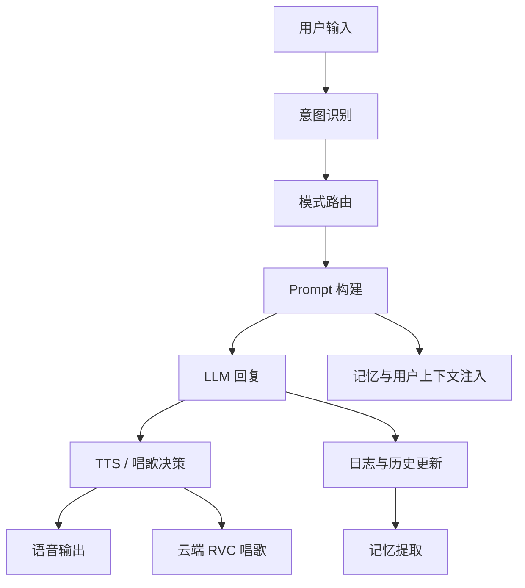
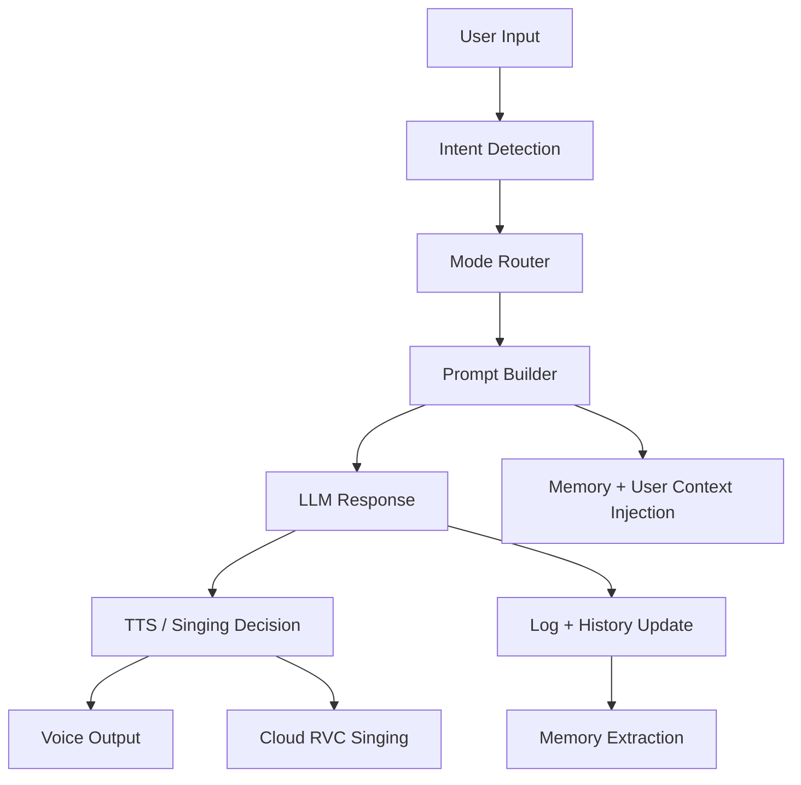

# VBF

[简体中文](#简体中文) | [English](#english)

---

## 简体中文

VBF（`VirtualBF`）是一个 AI 陪伴产品原型。我希望它不是“调用一次大模型然后返回一段文字”的普通 chatbot，而是一个具备角色感、记忆感、多模态交互能力的 AI 产品雏形。

这个项目主要覆盖了：

- 基于 LLM 的多轮对话与角色扮演
- 用户画像、长期记忆、动态上下文注入
- TTS 语音输出
- 基于云端 RVC 的 AI 唱歌链路
- Web 实时聊天界面与桌面 GUI
- 登录、日志记录、后台查看等产品化能力

这个仓库是为了面试展示整理出来的 `code-only` 版本，不包含本地私密数据、模型权重、缓存文件和聊天记录。

### 项目价值

这个项目更接近“AI 产品工程”而不是“模型 demo”。

系统会根据用户输入和当前状态决定接下来走哪条链路，例如：

- 普通聊天
- 哄睡 / 安抚模式
- 唱歌请求
- 语音播报
- 长期记忆提取
- 每用户历史管理

它体现的是一个完整的 AI 应用闭环：交互设计、Prompt 编排、状态管理、前后端协作、API 集成与产品体验优化。

### 核心能力

#### 1. AI 陪伴编排

- 识别用户意图，并路由到 `chat`、`sleep`、`wake`、`sing` 等模式
- 动态拼接系统提示词，将人设、用户画像和近期记忆注入当前请求
- 在 Web 端按用户维度维护独立历史
- 对旧对话进行摘要压缩，而不是简单截断

关键文件：

- `intent.py`
- `llm.py`
- `memory_vf.py`
- `main.py`

#### 2. 记忆与个性化

- 将角色 identity、用户 profile、长期记忆拆开管理
- 从对话中自动提取偏好、事实和每日片段
- 将近期事实和偏好重新注入后续回复

这让角色更像一个“持续认识你的人”，而不是每轮都重新开始的聊天机器人。

#### 3. 多模态输出

- 文本回复
- TTS 语音播报
- 点歌匹配与云端 RVC 唱歌流程
- 聊天语音与歌曲播放的统一编排

关键文件：

- `tts_module.py`
- `audio.py`
- `sing.py`
- `replicate_rvc.py`

#### 4. 两个产品界面

Web 端：

- Flask + Socket.IO 实时聊天
- 登录 / 登出
- 每用户会话处理
- 后台日志页
- 语音输入、自动播放、快捷回复、通话模式等前端体验

桌面端：

- CustomTkinter GUI
- 头像发光动画
- 后台线程处理聊天与唱歌
- 播放控制与状态反馈

### 架构概览



### 技术亮点

- `动态 Prompt 构建`：人设、记忆、用户画像按请求动态拼接，而不是写死在一个超长 system prompt 里
- `历史压缩`：旧消息先摘要再保留，兼顾上下文连续性和 token 控制
- `每用户隔离`：Web 版按登录用户分别维护历史
- `混合意图识别`：高置信度场景走规则，模糊场景交给 LLM 分类
- `云端唱歌链路`：把长音频生成放到云端，降低本地 GPU 依赖
- `产品体验意识`：停止唱歌、自动播放、输入中动画、快捷回复、后台日志都不是“附属品”，而是产品体验的一部分

### 技术栈

- `Python`
- `Flask`
- `Flask-SocketIO`
- `Flask-Login`
- `CustomTkinter`
- `SQLite`
- `Anthropic API`
- `Edge TTS`
- `Replicate`
- `HTML / CSS / JavaScript`

### 仓库结构

```text
.
├─ web_app.py            # Web 后端与实时事件处理
├─ gui.py                # 桌面 GUI 版本
├─ llm.py                # Prompt 构建、历史管理、模型调用
├─ memory_vf.py          # Identity、用户画像、长期记忆
├─ intent.py             # 意图路由
├─ sing.py               # 歌曲选择与唱歌入口
├─ replicate_rvc.py      # 云端 RVC 集成
├─ tts_module.py         # TTS 生成
├─ audio.py              # 本地播放辅助
├─ templates/            # Web 模板
├─ static/               # 前端资源
└─ models/.gitkeep       # 占位，权重未公开
```

### 本公开仓库未包含

- 本地 `.env` 密钥
- 模型权重与 index 文件
- 私有语音资产
- 歌曲库与生成后的音频
- 对话日志与用户记忆数据
- 本地缓存与中间产物

### 快速运行

1. 创建虚拟环境

```bash
python -m venv .venv
```

2. 安装依赖

```bash
pip install -r requirements.txt
```

3. 配置 `.env`

将 `.env.example` 复制为 `.env`，填写所需 API Key。

4. 启动 Web 版

```bash
python web_app.py
```

5. 或启动桌面版

```bash
python gui.py
```

### 面试可重点展开的点

- 人设、记忆和 Prompt 是怎么组织的
- 为什么选择“摘要压缩历史”而不是简单截断
- 多模态输出是如何由同一个对话状态机统一编排的
- 哪些能力放在本地，哪些能力交给云端 API
- 产品体验如何反向影响技术架构设计

---

## English

VBF (`VirtualBF`) is an AI companion product prototype. The goal was to build something closer to an actual AI product than a simple chatbot that only sends one prompt to an LLM and prints the reply.

The project includes:

- multi-turn conversation with persona control
- lightweight memory, user profile, and dynamic context injection
- TTS voice output
- an AI singing pipeline built on cloud RVC conversion
- a real-time Web interface and a desktop GUI
- product-facing features such as auth, logging, and an admin page

This repository is a `code-only` portfolio version prepared for interviews. Sensitive local data, model weights, caches, and private conversation records are intentionally excluded.

### Why this project matters

This project is much closer to **AI product engineering** than to a model demo.

Instead of returning plain text from one model call, the system decides which pipeline to run based on the current intent and conversation state, for example:

- normal conversation
- sleep / soothing mode
- singing requests
- TTS playback
- long-term memory extraction
- per-user history management

It demonstrates a full AI application loop: interaction design, prompt orchestration, state management, backend/frontend coordination, API integration, and UX optimization.

### Core capabilities

#### 1. AI companion orchestration

- Detects user intent and routes requests into `chat`, `sleep`, `wake`, or `sing`
- Builds prompts dynamically from persona settings, user profile, and recent memory
- Maintains isolated conversation history per user in the Web app
- Compresses older history into summaries instead of dropping context abruptly

Key files:

- `intent.py`
- `llm.py`
- `memory_vf.py`
- `main.py`

#### 2. Memory and personalization

- Separates character identity, user profile, and long-term memory
- Extracts preference and fact signals from conversations automatically
- Injects recent facts and preferences back into future replies

This makes the assistant feel more like a persistent character than a stateless chatbot.

#### 3. Multi-modal output

- text response generation
- TTS voice playback
- song request matching and cloud RVC singing
- unified orchestration for both spoken replies and generated songs

Key files:

- `tts_module.py`
- `audio.py`
- `sing.py`
- `replicate_rvc.py`

#### 4. Two product surfaces

Web app:

- Flask + Socket.IO real-time chat
- login / logout flow
- per-user session handling
- admin log viewer
- frontend UX such as voice input, autoplay, quick replies, and call mode

Desktop app:

- CustomTkinter GUI
- animated avatar glow feedback
- background thread handling for chat and singing
- playback control and status updates

### Architecture overview



### Technical highlights

- `Dynamic prompt construction`: persona, memory, and user profile are composed per request instead of living in one static prompt
- `History compaction`: older messages are summarized to preserve continuity while controlling prompt size
- `Per-user isolation`: the Web version keeps separate history state for each logged-in user
- `Hybrid intent detection`: rules handle high-confidence cases, while fuzzy cases fall back to LLM classification
- `Cloud singing pipeline`: long audio generation is offloaded to a remote workflow instead of depending on a local GPU
- `Product-minded UX`: stop singing, autoplay, typing indicators, quick replies, and admin visibility were implemented as product features, not afterthoughts

### Tech stack

- `Python`
- `Flask`
- `Flask-SocketIO`
- `Flask-Login`
- `CustomTkinter`
- `SQLite`
- `Anthropic API`
- `Edge TTS`
- `Replicate`
- `HTML / CSS / JavaScript`

### Repository structure

```text
.
├─ web_app.py            # Web backend and real-time event handling
├─ gui.py                # Desktop GUI version
├─ llm.py                # Prompt building, history management, model calls
├─ memory_vf.py          # Identity, user profile, long-term memory
├─ intent.py             # Intent routing
├─ sing.py               # Song selection and singing entry
├─ replicate_rvc.py      # Cloud RVC integration
├─ tts_module.py         # TTS generation
├─ audio.py              # Local playback helpers
├─ templates/            # Web templates
├─ static/               # Frontend assets
└─ models/.gitkeep       # Placeholder only; weights excluded
```

### Excluded from this public repository

- local `.env` secrets
- model weights and index files
- private voice assets
- song library and generated audio
- chat logs and user memory data
- local caches and intermediate outputs

### Quick start

1. Create a virtual environment

```bash
python -m venv .venv
```

2. Install dependencies

```bash
pip install -r requirements.txt
```

3. Configure `.env`

Copy `.env.example` to `.env` and fill in the required API keys.

4. Start the Web version

```bash
python web_app.py
```

5. Or start the desktop version

```bash
python gui.py
```

### Good interview discussion points

- how persona, memory, and prompt assembly are organized
- why history summarization was used instead of naive truncation
- how multi-modal outputs are orchestrated from one conversation state machine
- which capabilities run locally vs. through cloud APIs
- how product UX decisions shaped the technical architecture
