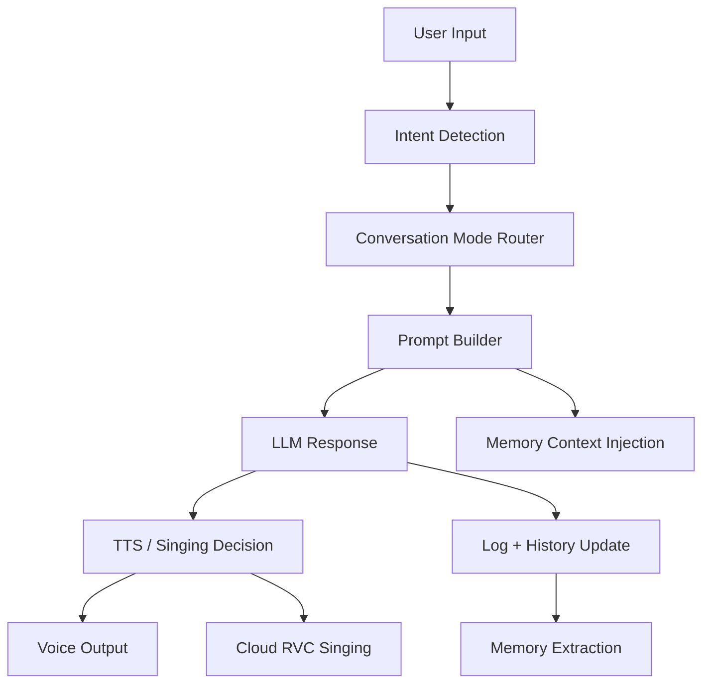

# VBF

VBF, short for `VirtualBF`, is an AI companion product prototype that turns a language model into a multi-modal interactive character instead of a plain chatbot.

The project combines:

- long-context chat with persona control
- lightweight memory and user-profile injection
- TTS voice playback
- AI singing workflow based on cloud RVC conversion
- a real-time Web app and a desktop GUI
- basic auth, logging, and operator-facing admin pages

This repository is intentionally published as a `code-only` portfolio version for interviews. Sensitive local data, private assets, runtime caches, model weights, and chat records are excluded.

## Why This Project Matters

This was built as a product-style AI application rather than a model demo.

Instead of only calling an LLM API and printing text, the system decides how to respond based on user intent, conversation mode, memory state, and output channel. A single interaction may trigger different pipelines such as:

- normal emotional conversation
- sleep / soothing mode
- singing request routing
- TTS generation and playback
- long-term memory extraction
- per-user history management

For interview purposes, the most important part is that this project demonstrates end-to-end AI product engineering: interaction design, orchestration logic, backend services, frontend UX, state management, and practical API integration.

## Core Capabilities

### 1. AI Companion Orchestration

- Detects user intent and routes requests into `chat`, `sleep`, `wake`, or `sing`.
- Builds dynamic prompts from persona settings, user profile, and recent memory.
- Manages per-user conversation history in the Web app.
- Compresses old history into summaries instead of dropping context abruptly.

Relevant files:

- `intent.py`
- `llm.py`
- `memory_vf.py`
- `main.py`

### 2. Memory and Personalization

- Stores character identity separately from user profile and long-term memory.
- Extracts simple memory signals from conversations automatically.
- Injects recent facts, preferences, and daily summaries back into future replies.

This gives the assistant a stronger sense of continuity and makes the product feel closer to a persistent character than a stateless chatbot.

### 3. Multi-Modal Output

- Text reply generation via LLM
- TTS playback for emotional voice output
- Song request matching and cloud-based RVC singing pipeline
- Playback orchestration for both chat speech and generated songs

Relevant files:

- `tts_module.py`
- `audio.py`
- `sing.py`
- `replicate_rvc.py`

### 4. Two Product Surfaces

#### Web app

- Flask + Socket.IO real-time chat
- login/logout flow
- per-user session handling
- admin log viewer
- mobile-style frontend with typing animation, audio autoplay, voice input, and quick replies

Relevant files:

- `web_app.py`
- `templates/chat.html`
- `templates/login.html`
- `templates/logs.html`
- `static/chat.js`
- `static/style.css`

#### Desktop app

- CustomTkinter GUI
- animated avatar glow feedback
- threaded background processing for chat and singing
- playback control and status updates

Relevant file:

- `gui.py`

## Architecture Overview



## Technical Highlights

- `Dynamic prompt construction`: persona, memory, and user-profile context are assembled per request instead of living in one static system prompt.
- `History compaction`: older messages are summarized to preserve context while controlling prompt size.
- `Per-user isolation`: the Web version keeps separate history state per logged-in user.
- `Hybrid intent detection`: rules handle high-confidence cases; LLM classification handles fuzzy ones.
- `Cloud singing pipeline`: long audio generation is offloaded to a remote RVC workflow instead of requiring a local GPU.
- `Product-minded UX`: stop singing, auto-play voice, typing indicators, quick replies, and admin visibility were all implemented as usability features, not just engineering extras.

## Tech Stack

- `Python`
- `Flask`
- `Flask-SocketIO`
- `Flask-Login`
- `CustomTkinter`
- `SQLite`
- `Anthropic API`
- `Edge TTS`
- `Replicate`
- `HTML / CSS / JavaScript`

## Repository Structure

```text
.
├─ web_app.py            # Web backend and real-time event handling
├─ gui.py                # Desktop GUI version
├─ llm.py                # Prompt assembly, history management, model calls
├─ memory_vf.py          # Identity, user profile, long-term memory
├─ intent.py             # Intent routing
├─ sing.py               # Song selection and singing pipeline entry
├─ replicate_rvc.py      # Cloud RVC conversion integration
├─ tts_module.py         # TTS generation
├─ audio.py              # Local playback helpers
├─ templates/            # Web templates
├─ static/               # Frontend assets
└─ models/.gitkeep       # Placeholder only; weights excluded
```

## Excluded From This Public Repository

The original local project contains additional runtime state and assets that are intentionally not published:

- local `.env` secrets
- model weights and index files
- private voice assets
- song library and generated audio
- chat logs and user memory data
- local caches and temporary output

This keeps the repo safe to share while still preserving the engineering work and project structure.

## Quick Start

### 1. Create a virtual environment

```bash
python -m venv .venv
```

### 2. Install dependencies

```bash
pip install -r requirements.txt
```

### 3. Create `.env`

Copy `.env.example` to `.env` and fill in the values you want to use.

### 4. Start the Web version

```bash
python web_app.py
```

### 5. Or start the desktop version

```bash
python gui.py
```

## Interview Talking Points

If you are reviewing this repo as part of an interview, the strongest discussion topics are:

- how persona + memory were injected into prompt building
- why history compaction was used instead of naive truncation
- how multi-modal outputs were orchestrated from one conversational state machine
- what tradeoffs were made between local inference and cloud APIs
- how product UX decisions shaped the technical architecture

## Notes

- The published version is meant to showcase architecture and implementation, not to provide plug-and-play production deployment.
- Some provider-specific credentials and assets are required before the full voice / singing experience can run end-to-end.
