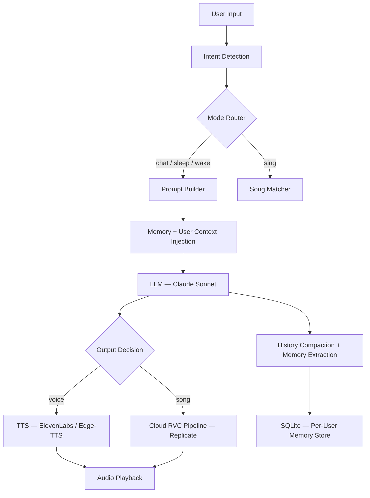

<div align="right">
  <b>English</b> | <a href="README_CN.md">中文</a>
</div>

<br>

<p align="center">
  <h1 align="center">🎙️ VBF — Virtual Companion Framework</h1>
  <p align="center">
    An AI companion system with intent-driven mode routing, dynamic persona & long-term memory,<br>
    multi-modal output (TTS + cloud RVC singing), real-time Web interface, and a desktop GUI.
  </p>
</p>

<p align="center">
  
  
  
  
  
  
</p>

---

## Overview

VBF is an AI companion product prototype. Instead of a simple chatbot that sends one prompt and returns plain text, VBF is designed as a full **AI product engineering** system:

- The system detects user **intent** and routes each request into the appropriate pipeline
- **Persona, memory, and user profile** are dynamically composed per request — not stored in one static system prompt
- **Older conversation history** is summarized rather than truncated, preserving continuity
- Both a **real-time Web interface** (Flask + Socket.IO) and a **desktop GUI** (CustomTkinter) are supported

> This repository is a `code-only` portfolio version. Sensitive data, model weights, private voice assets, chat logs, and local caches are intentionally excluded.

---

## Architecture



---

## Core Features

### 1. Intent-Driven Mode Router
Classifies each user message into one of four modes:

| Mode | Trigger | Behavior |
|------|---------|----------|
| `chat` | Normal conversation | Warm, short replies with dynamic persona |
| `sleep` | Wind-down / soothing requests | Slow, minimal, calming responses |
| `wake` | Wake-up triggers | Return to normal conversational mode |
| `sing` | Song requests | Match → Cloud RVC generation → audio playback |

High-confidence cases use rule-based detection; ambiguous inputs fall back to LLM classification.

### 2. Dynamic Prompt Construction
Persona identity, user profile, and recent memory are fetched and composed **per request** from separate data stores. This keeps the system prompt minimal and fast while making the assistant feel contextually aware.

### 3. History Compaction
When conversation history exceeds a configurable threshold, the oldest turns are summarized into a single sentence rather than dropped. This preserves conversational continuity while controlling prompt size and cost.

### 4. Multi-Modal Output Pipeline

| Output Type | Technology |
|-------------|-----------|
| Text reply | Claude Sonnet (Anthropic API) |
| Chat voice | ElevenLabs / Edge-TTS (fallback) |
| AI singing | Demucs vocal separation → Replicate cloud RVC |
| Mixed audio | Custom vocal + accompaniment mixer |

### 5. Web App (Flask + Socket.IO)
- Real-time chat via WebSocket
- Per-user session isolation with Flask-Login
- Voice input, autoplay, quick-reply shortcuts, call mode
- Admin log viewer

### 6. Desktop GUI (CustomTkinter)
- Avatar with animated glow feedback
- Background-threaded chat and singing
- Playback control and status indicators

---

## Project Structure

```
vbf/
├── web_app.py          # Flask web backend + Socket.IO event handling
├── gui.py              # Desktop GUI (CustomTkinter)
├── main.py             # CLI entry point
│
├── llm.py              # Prompt builder, history manager, model calls
├── memory_vf.py        # Identity, user profile, long-term memory
├── intent.py           # Intent classification and mode routing
│
├── tts_module.py       # TTS generation (ElevenLabs / Edge-TTS)
├── audio.py            # Local playback helpers
├── sing.py             # Song selection and singing orchestration
├── replicate_rvc.py    # Cloud RVC integration (Replicate)
├── rvc_infer.py        # Local RVC inference
├── demucs_wrapper.py   # Vocal separation (Demucs)
│
├── config.py           # All configuration + env var loading
├── design_voice.py     # Voice profile design utilities
│
├── templates/          # Jinja2 web templates
├── static/             # Frontend assets (CSS, JS)
├── models/             # Model weight directory (weights excluded)
│
├── requirements.txt
├── .env.example
└── .gitignore
```

---

## Quick Start

### Prerequisites
- Python 3.11+
- API keys: Anthropic, ElevenLabs (optional), Replicate (for singing)

### Setup

```bash
# 1. Clone and create virtual environment
git clone https://github.com/GitGPT-jpg/VBF.git
cd VBF
python -m venv .venv

# 2. Activate (macOS/Linux)
source .venv/bin/activate
# Activate (Windows)
.venv\Scripts\activate

# 3. Install dependencies
pip install -r requirements.txt

# 4. Configure environment
cp .env.example .env
# Edit .env with your API keys
```

### Run the Web App
```bash
python web_app.py
# → Open http://localhost:5000
```

### Run the Desktop GUI
```bash
python gui.py
```

### Run the CLI
```bash
python main.py
```

---

## Environment Variables

| Variable | Required | Description |
|----------|----------|-------------|
| `ANTHROPIC_API_KEY` | ✅ Yes | Claude API key (core LLM) |
| `ANTHROPIC_BASE_URL` | No | Custom API endpoint (default: `https://api.anthropic.com`) |
| `ELEVENLABS_API_KEY` | Optional | ElevenLabs voice synthesis |
| `ELEVENLABS_VOICE_ID` | Optional | ElevenLabs target voice |
| `REPLICATE_API_KEY` | Optional | Cloud RVC singing pipeline |
| `FISH_AUDIO_API_KEY` | Optional | Fish Audio TTS (fallback) |
| `WEB_SECRET_KEY` | ✅ Yes | Flask session secret (change before deploy) |
| `WEB_PORT` | No | Web server port (default: `5000`) |
| `WEB_USER` | No | Admin login username |
| `WEB_PASS` | No | Admin login password |
| `WEB_GF_USER` | No | Companion user login |
| `WEB_GF_PASS` | No | Companion user password |

---

## Docker Deployment

```yaml
# docker-compose.yml
version: "3.9"
services:
  vbf:
    build: .
    ports:
      - "5000:5000"
    env_file: .env
    volumes:
      - ./models:/app/models
      - ./songs:/app/songs
    restart: unless-stopped
```

```bash
docker compose up -d
```

---

## What This Repository Excludes

| Excluded | Reason |
|----------|--------|
| `.env` secrets | Security |
| Model weights (`.pth`, `.index`) | File size / privacy |
| Private voice assets | Privacy |
| Song library and generated audio | Privacy |
| Chat logs and memory data | Privacy |
| Local caches (`tts_cache/`, `vocal_cache/`, `sing_output/`) | Derived artifacts |

---

## Tech Stack

| Layer | Technology |
|-------|-----------|
| Language | Python 3.11 |
| Web Framework | Flask 3, Flask-SocketIO, Flask-Login |
| Desktop GUI | CustomTkinter |
| LLM | Claude Sonnet (Anthropic API) |
| TTS | ElevenLabs, Edge-TTS |
| Voice Conversion | RVC (local), Replicate (cloud) |
| Audio Processing | Demucs, pydub, sounddevice |
| Storage | SQLite (memory), filesystem (audio cache) |
| Frontend | HTML / CSS / Vanilla JS |

---

## Roadmap

- [ ] Streaming text output with real-time frontend rendering
- [ ] Vector-based long-term memory retrieval (replace SQLite keyword search)
- [ ] Multi-voice support (switchable personas)
- [ ] Mobile web interface
- [ ] REST API with OpenAPI spec
- [ ] Containerized deployment with GPU support

---

## License

MIT © [GitGPT-jpg](https://github.com/GitGPT-jpg)