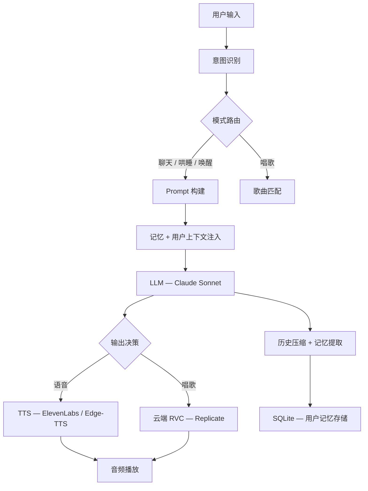

<div align="right">
  <a href="README.md">English</a> | <b>中文</b>
</div>

<br>

<p align="center">
  <h1 align="center">🎙️ VBF — 虚拟陪伴框架</h1>
  <p align="center">
    基于意图路由的 AI 陪伴系统，支持动态人设与长期记忆、多模态输出（TTS + 云端 RVC 唱歌）、<br>
    实时 Web 聊天界面与桌面 GUI。
  </p>
</p>

<p align="center">
  
  
  
  
  
  
</p>

---

## 项目简介

VBF 是一个 AI 陪伴系统原型。它不是"调用一次大模型然后返回一段文字"的普通 chatbot，而是一个完整的 **AI 产品工程** 系统：

- 自动检测用户**意图**，路由到对应的处理链路
- **人设、记忆、用户画像**按请求动态拼接，而非固定在一个超长 system prompt 中
- **历史对话**进行摘要压缩而非简单截断，保留上下文连续性
- 同时支持**实时 Web 界面**（Flask + Socket.IO）和**桌面 GUI**（CustomTkinter）

> 本仓库为面试展示用的 `code-only` 版本，不包含本地密钥、模型权重、私有语音资产、聊天记录及本地缓存。

---

## 系统架构



---

## 核心能力

### 1. 意图驱动的模式路由
将用户消息分类到四种模式：

| 模式 | 触发条件 | 行为 |
|------|---------|------|
| `chat` | 普通聊天 | 带动态人设的温柔简短回复 |
| `sleep` | 哄睡 / 安抚请求 | 语气轻柔缓慢，不提问，引导放松 |
| `wake` | 唤醒触发词 | 返回正常聊天模式 |
| `sing` | 点歌请求 | 匹配歌曲 → 云端 RVC 生成 → 音频播放 |

高置信度场景走规则匹配，模糊场景交给 LLM 分类。

### 2. 动态 Prompt 构建
人设 identity、用户画像和近期记忆从独立存储中**按请求动态拼接**，保持系统 prompt 简短高效，同时让助手感受到上下文感知。

### 3. 历史摘要压缩
对话历史超过配置阈值时，最早的几轮被压缩成一句摘要保留，而不是直接丢弃。既保留对话连续性，又控制 prompt 长度和 token 成本。

### 4. 多模态输出链路

| 输出类型 | 技术 |
|---------|------|
| 文本回复 | Claude Sonnet（Anthropic API） |
| 聊天语音 | ElevenLabs / Edge-TTS（备用） |
| AI 唱歌 | Demucs 人声分离 → Replicate 云端 RVC |
| 混音 | 自定义人声 + 伴奏混音器 |

### 5. Web 端（Flask + Socket.IO）
- WebSocket 实时聊天
- Flask-Login 每用户会话隔离
- 语音输入、自动播放、快捷回复、通话模式
- 后台日志查看页面

### 6. 桌面 GUI（CustomTkinter）
- 头像发光动画反馈
- 后台线程处理聊天与唱歌
- 播放控制与状态显示

---

## 目录结构

```
vbf/
├── web_app.py          # Flask Web 后端 + Socket.IO 事件处理
├── gui.py              # 桌面 GUI（CustomTkinter）
├── main.py             # CLI 入口
│
├── llm.py              # Prompt 构建、历史管理、模型调用
├── memory_vf.py        # 人设 Identity、用户画像、长期记忆
├── intent.py           # 意图分类与模式路由
│
├── tts_module.py       # TTS 生成（ElevenLabs / Edge-TTS）
├── audio.py            # 本地播放辅助
├── sing.py             # 歌曲选择与唱歌编排
├── replicate_rvc.py    # 云端 RVC 集成（Replicate）
├── rvc_infer.py        # 本地 RVC 推理
├── demucs_wrapper.py   # 人声分离（Demucs）
│
├── config.py           # 全局配置 + 环境变量加载
├── design_voice.py     # 音色设计工具
│
├── templates/          # Jinja2 Web 模板
├── static/             # 前端资源（CSS、JS）
├── models/             # 模型权重目录（权重未公开）
│
├── requirements.txt
├── .env.example
└── .gitignore
```

---

## 快速启动

### 前置要求
- Python 3.11+
- API Key：Anthropic（必须）、ElevenLabs（可选）、Replicate（唱歌功能需要）

### 安装步骤

```bash
# 1. 克隆并创建虚拟环境
git clone https://github.com/GitGPT-jpg/VBF.git
cd VBF
python -m venv .venv

# 2. 激活（macOS/Linux）
source .venv/bin/activate
# 激活（Windows）
.venv\Scripts\activate

# 3. 安装依赖
pip install -r requirements.txt

# 4. 配置环境变量
cp .env.example .env
# 编辑 .env 填入 API Key
```

### 启动 Web 版
```bash
python web_app.py
# → 浏览器打开 http://localhost:5000
```

### 启动桌面版
```bash
python gui.py
```

### 启动命令行版
```bash
python main.py
```

---

## 环境变量说明

| 变量 | 是否必须 | 说明 |
|------|---------|------|
| `ANTHROPIC_API_KEY` | ✅ 必须 | Claude API Key（核心 LLM） |
| `ANTHROPIC_BASE_URL` | 否 | 自定义 API 端点（默认：`https://api.anthropic.com`） |
| `ELEVENLABS_API_KEY` | 可选 | ElevenLabs 语音合成 |
| `ELEVENLABS_VOICE_ID` | 可选 | ElevenLabs 目标音色 ID |
| `REPLICATE_API_KEY` | 可选 | 云端 RVC 唱歌链路 |
| `FISH_AUDIO_API_KEY` | 可选 | Fish Audio TTS（备用） |
| `WEB_SECRET_KEY` | ✅ 必须 | Flask Session 密钥（部署前必须修改） |
| `WEB_PORT` | 否 | Web 服务端口（默认：`5000`） |
| `WEB_USER` | 否 | 管理员登录用户名 |
| `WEB_PASS` | 否 | 管理员登录密码 |
| `WEB_GF_USER` | 否 | 陪伴账户用户名 |
| `WEB_GF_PASS` | 否 | 陪伴账户密码 |

---

## Docker 部署

```yaml
# docker-compose.yml
version: "3.9"
services:
  vbf:
    build: .
    ports:
      - "5000:5000"
    env_file: .env
    volumes:
      - ./models:/app/models
      - ./songs:/app/songs
    restart: unless-stopped
```

```bash
docker compose up -d
```

---

## 本公开仓库未包含

| 未包含内容 | 原因 |
|-----------|------|
| `.env` 密钥 | 安全 |
| 模型权重（`.pth`、`.index`） | 文件过大 / 隐私 |
| 私有语音资产 | 隐私 |
| 歌曲库和生成的音频 | 隐私 |
| 聊天记录和用户记忆数据 | 隐私 |
| 本地缓存（`tts_cache/`、`vocal_cache/`、`sing_output/`） | 派生产物 |

---

## 技术栈

| 层次 | 技术 |
|------|------|
| 语言 | Python 3.11 |
| Web 框架 | Flask 3、Flask-SocketIO、Flask-Login |
| 桌面 GUI | CustomTkinter |
| 大模型 | Claude Sonnet（Anthropic API） |
| TTS | ElevenLabs、Edge-TTS |
| 音色转换 | RVC（本地）、Replicate（云端） |
| 音频处理 | Demucs、pydub、sounddevice |
| 存储 | SQLite（记忆）、文件系统（音频缓存） |
| 前端 | HTML / CSS / 原生 JS |

---

## Roadmap

- [ ] 流式文本输出 + 前端实时渲染
- [ ] 基于向量检索的长期记忆（替换 SQLite 关键词搜索）
- [ ] 多音色支持（可切换的人设）
- [ ] 移动端 Web 界面
- [ ] REST API + OpenAPI 文档
- [ ] 带 GPU 支持的容器化部署方案

---

## 面试重点展开

- 人设、记忆和 Prompt 是如何组织和分离的
- 为什么选择"摘要压缩"而不是简单截断
- 多模态输出如何由同一个对话状态机统一编排
- 哪些能力放本地，哪些能力交给云端 API
- 产品体验设计如何反向影响技术架构决策

---

## License

MIT © [GitGPT-jpg](https://github.com/GitGPT-jpg)